# Design and manufacture of 2 mechanical mechanisms 
## Overview
This project required a 1mm diameter ball to be transported across a 100mm cube via 2 distinct mechanical designs. Working in pairs, the team had to complete the task and achieve the transportation of the ball in exactly 5 seconds. 

## Objectives
- Design 2 working mechanical mechanisms.
- Introduction to Inventor simulation for prototying virtually.
- Physical prototyping using additive manufacturing via 3D PLA printing.
- Design for assembly and manufacturing.
- Create a asembly instruction manual for any person to follow and assemble our whole product.

## Tools and concepts used
- Inventor
- Inventor dynamic simulation environment (very basic. Partner did this section)
- 3D printing techniques
- Design for assembly
- Gear ratio calculations for planetary gears
- Using drawings for effective communication

## Methodology

### Brainstorming
Our team wanted a simple solution that could work well and was not over engineered. Asthe brief had an input of 60 rpm, and the ball had to go across the cube, a gear reducer mechanism needed to be implemented. The second mechanism would need to transport the ball across the cube. After initial brainstorming, we narrowed down the second mechanism to be a scotch yoke mechanism. However, during the manufacturing phase, countless iterations were tried and failed. We realised that we were wasting too much time trying to fine tune the scotch yoke mechanism. Everytime we solved a problem, another problem came up. Thus, we decided to change our second mechanism. After a second round of brainstorming, we decided that a cam mechanism may be a better option.

### Inventor
Each of us took a mechanism to design and create parts for manufacturing. I was in charge of the gear reducer while my partner was in charge of the initial scotch and yoke mechanism, which became the cam mechanism. In order to gauge how far the ball had to travel, the ramp for the ball had to be designed first. I took up that role, and designed a ramp which allowed the ball to line up with the exit hole. Hpwever, due to the change in second mechanism, the ramp had to be redesigned. The overll distance was kept constant to ensure that the timing would not affect the gear ratio. After the distance was calculated, the Inventor gear generator was used to create the gears. However, during designing, it was realised that the use of spur gears was too big, and to reduce the gear size would mean that the number of stages would increase. Unfortunately, due to the tight space constraints, any stage larger than 2 could not be used. Thus, a planetary gear system was implemented. The gear reduction was effectively the same, but the gear teeth had to be calculated. I used chatGPT and youtube videos for research to understand the concept of the planetary system. The gear system was designed using the gear generator and modified slightly during manufacturing. Some modifications included joining the ring gears to ensure they were one part, and embossing a number and letter system so that users could identify parts easily. 

### Simulation and manufacturing
The simulation of the whole system was done by my partner, as she did it while I was designing the gear reducer, and finalising it. Although she did the bulk of the simulation, I tried to implement parts of our system and managed to get some parts moving. Understanding how the different simulation constraints acted on the pieces helped me with understanidn my full system better. After simulation, manufacturing began, which I took charge of. Our team was constantly in communication with any edits or adjustments we did. We were also aware of each others parts and numbers, as we needed each others parts to ensure a proper finalised fitment. During manufacturing, we came up with the idea to emboss all parts in the design. After a few trial and erros with sizinf and location dureing 3D printing, most of the embossed texts came out clearly. During 3D printing, the orientation of each part placed on the printing bed was crucial. Some orientations used lesser supports, but had less defined parts, while other orientations used more supports and had more detail in parts. The parts which needed proper definition were the gears and the cam and follower pieces. Wherver supports could be reduced, it was redesigned or re-orientated on the printing bed. The final pieces for assembly were mainly well printed, with a few pieces not fitting well due to them being too small. 

### Assembly instructions
The assembly instructions implemented drawings of each sub assembly of the whole mechanism. Snapshots of each step was used and annotated to effectviely communicate how the pices fit with each other. Arrows were used to show placements as well. For the gear ratio, a full exploded view was used at the start to show how each piece could fit into each other. A page portraying all parts was also made at the start of each mechanism for the user. Once my partner and I had compiled each of our assembly instructions of each mechanism, the full assembly was appendaged and combined. The box acrylic pieces were laser cut from 3mm acrylic sheets and given to each team. We had to follow a separate assembly instruction to assemble the box, and we had to implement the box assembly into our mechanism assembly. The final, completed assembly instructions can be found in the files of this repository.

## Results 
During the showcase of our mechanism, the gear reducer worked very well. The ball also managed to move acorss the box in approximately 5 seconds. However, a small part of the cam follower mechanism unfortunately was not tight enough and kept falling out. This made it hard to continuously test our mechanisms over as we had to keep reassembling that small part that kept falling out. This was unfortunately due to the fact that the part was too tiny for 3D printing, which caused an ineffective print. We were quite dissappointed in that particular part, as the rest of the mechanism worked really well, and we managed to get a few full runs as well. We managed to score a reasonably high mark, but it could have been much better.

## Project Images
These images show my parts of the project and how I contributed to the full prototype. Check the files to find the PDF of the full instrcutions.

  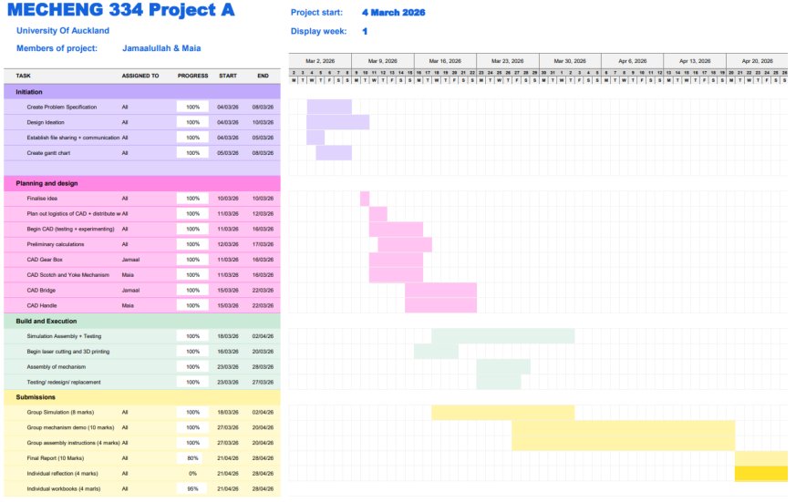

  <i>Figure 1: Gantt chart of project </i>

  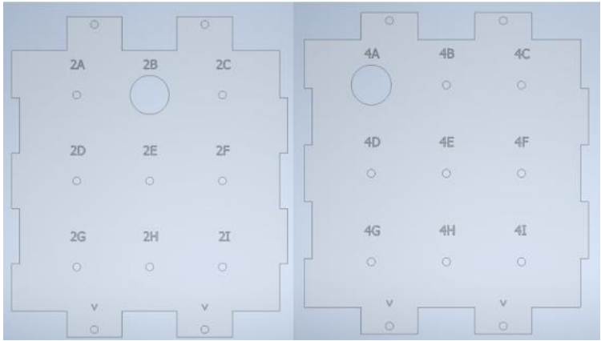

  <i>Figure 2: Entry and exit holes </i>

The entry and exit holes were at the top row, but not aligned. This meant that the ball had to be moved across to be aligned. 

  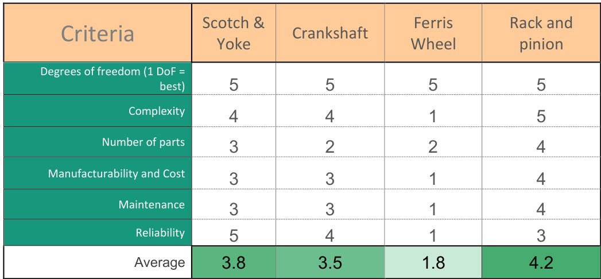

  <i>Figure 3: MART analysis for second mechanism </i>

  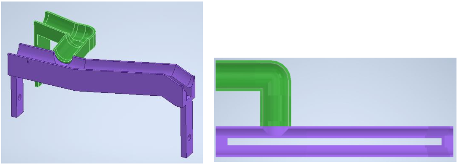

  <i>Figure 4: First ramp iteration </i>

The first ramp iteration which I designed. Was one full piece, which meant alot of support material was used during manufacturing. 

  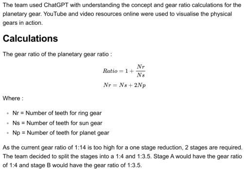
  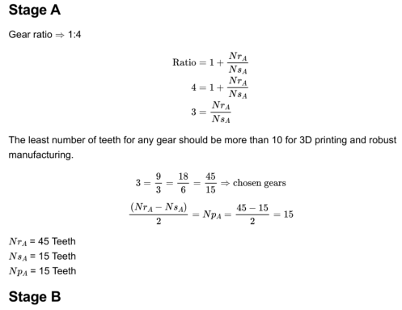
  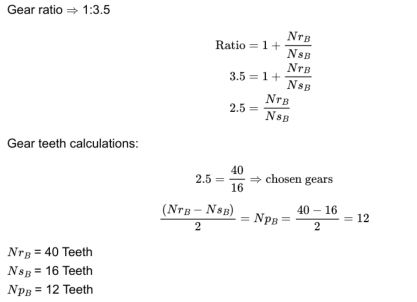
  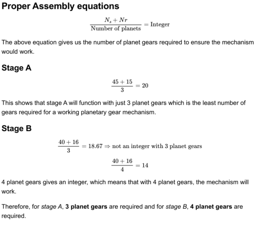

  <i>Figure 5: Gear ratio Calculations</i>

 

  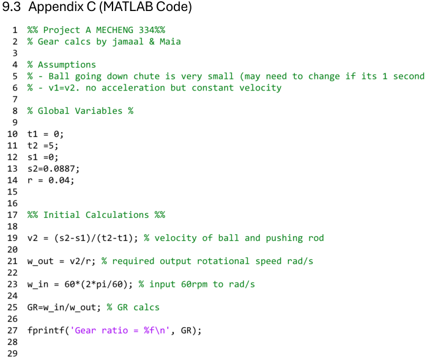

  <i>Figure 6: MATLAB code for gear ratio calculations </i>

Images above show the caclulations I did for calculating the gear ratio for the planetary gear reducer. I utilised a MATLAB code to help check my physical caculations and for any quick changes and edits.

  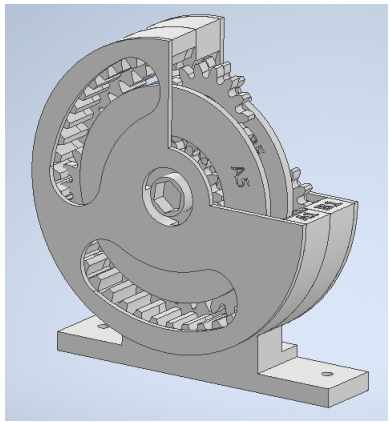

  <i>Figure 7: Final Gearbox model </i>

THe final gear box model with embossed featured on the parts for ease of identification during assembly.

  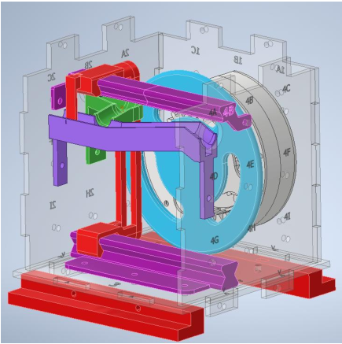

  <i>Figure 8: Scotch Yoke iteration </i>

One of the scotch yoke mechanism iterations which nearly worked. However, there was too much friction acting on the rails and too much twisting from the turning pin attached to the blue circular disk. The twisting force could not be overcome and thus the mechanism had to changed.

  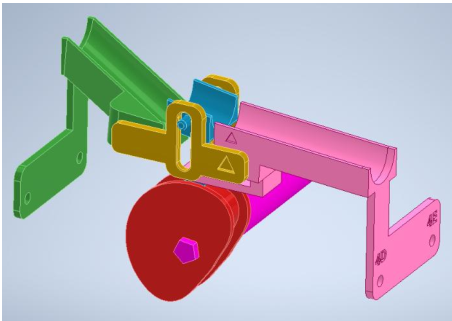

  <i>Figure 9: Cam iteration with new ramp </i>

The cam iteration and ramp designed by my project partner. She also implemented the embossments for ease during assembly.

  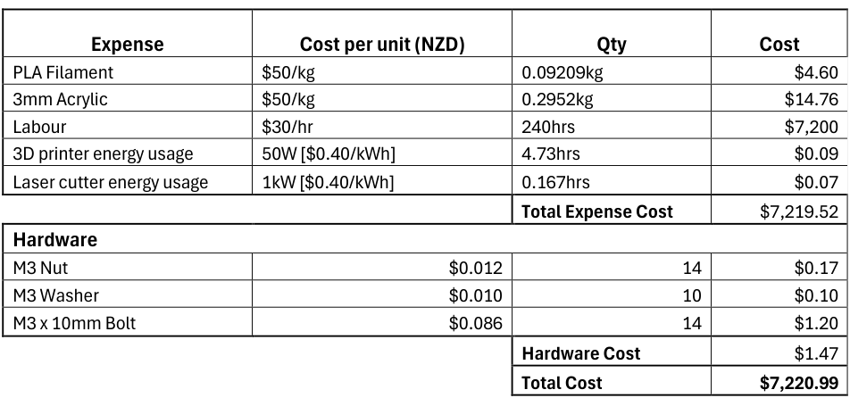

  <i>Figure 10: Time cost analysis </i>

Full time cost analysis for the whole prototype. 

  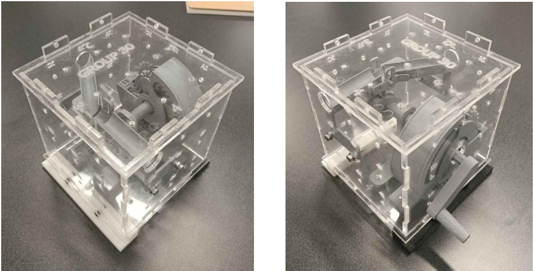

  <i>Figure 11: Physical Prototype </i>

The final physical prototype before the demonstration.

  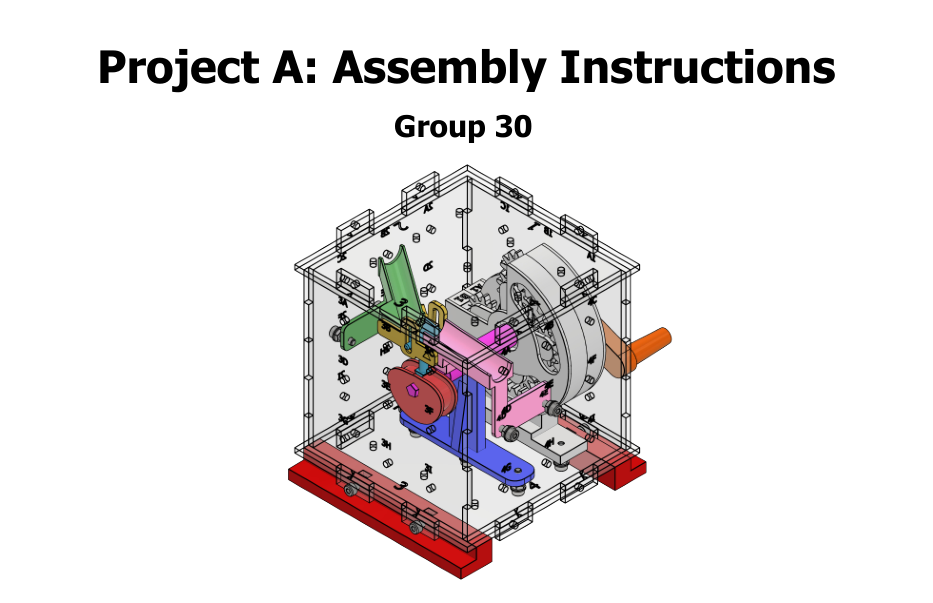
  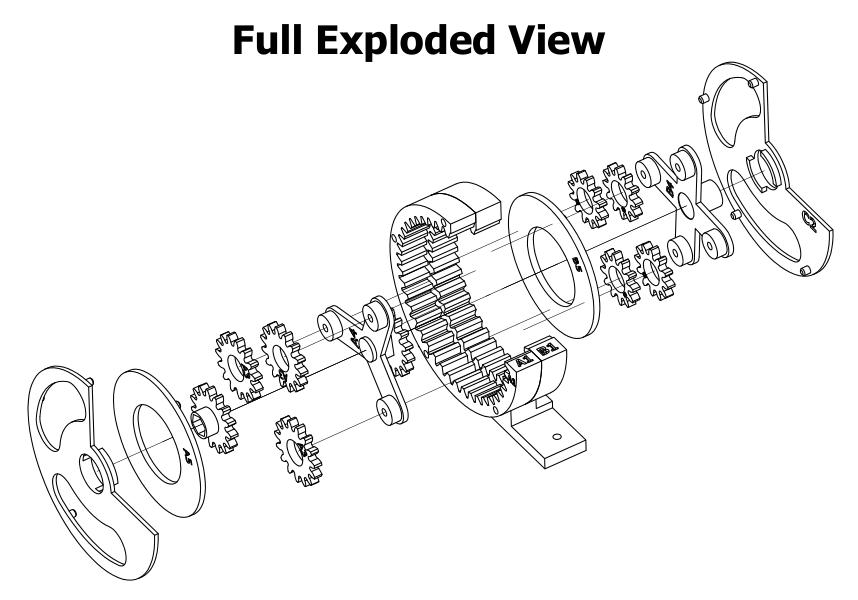
  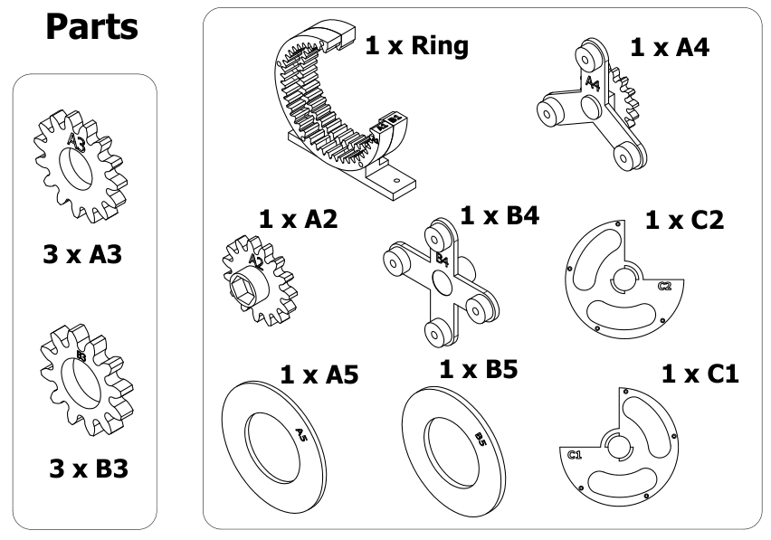

  <i>Figure 12: Prototype assembly instructions </i>

The full assembly instructions can be found in the files pdf.

## What I learnt
- Design for assembly requires alot more thinking ahead than I initially expected. Alot of materials and time could be saved if we had thought abit more before manufacturing.
- I learnt the inventor simulation environment. I did not learn in detail how to simulate properly, but I was exposed to the new environment and know what to look out for.
- How to create effective assembly instructions, and how images and arrows can be more effective than just words.
- How to communicate with a partner especially when multiple parts are needed and need to work together.

<!-- 

  

  <i>Figure 1: </i>

 --!>

